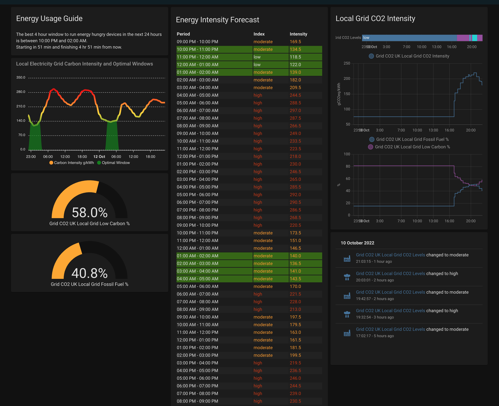

# Carbon Intensity UK sensor (forked)

[![GitHub Release][releases-shield]][releases]

[![GitHub Activity][commits-shield]][commits]
[![License][license-shield]](LICENSE)

[![hacs][hacsbadge]][hacs]
![Project Maintenance][maintenance-shield]

_Component to integrate with [Carbon Intensity UK][carbon_intensity_uk]._

**This component will set up the following platforms.**

Platform | Description
-- | --
`service` | Provides sensors with info from Carbon Intensity UK API.

Available sensors are:
Sensor | Description
-- | --
`Local CO2 intensity forecast` | This has attributes for the next 48 hours co2 intensity forecast which can be used for forecasting and optimal window work. 
`Local Grid CO2 Itensity` | Current local grid co2 intensity in gCO2eq/kwh
`Local Grid CO2 Levels` | String identifying current CO2 intensity, e.g. 'Low'
`Local Grid Fossil Fuel %` | Percentage of local grid electricity from Gas, Coal, Oil
`Local Grid Low Carbon %` | Percentage of local grid electricity from Hydro, Solar, Wind, Biomass
`Local Optimal Window From` | Time when the next 4h optimal window for low carbon runs from
`Local Optimal Window To` | End time of the 4h optimal window. 

The sensor retrieves information using [Carbon Intensity UK API library (forked)](https://github.com/alanmcgore/carbonintensity) - It adds in additional data based on [work by jfparis in his fork](https://github.com/jfparis/sensor.carbon_intensity_uk) as well as a percentage of the grid in low carbon energy and potentially additional entities. 

## Installation

1. Using the tool of choice open the directory (folder) for your HA configuration (where you find `configuration.yaml`).
2. If you do not have a `custom_components` directory (folder) there, you need to create it.
3. In the `custom_components` directory (folder) create a new folder called `carbon_intensity_uk`.
4. Download _all_ the files from the `custom_components/carbon_intensity_uk/` directory (folder) in this repository.
5. Place the files you downloaded in the new directory (folder) you created.
6. Restart Home Assistant
7. In the HA UI go to "Configuration" -> "Integrations" click "+" and search for "Carbon Intensity UK"

Using your HA configuration directory (folder) as a starting point you should now also have this:

```text
custom_components/carbon_intensity_uk/.translations/en.json
custom_components/carbon_intensity_uk/__init__.py
custom_components/carbon_intensity_uk/config_flow.py
custom_components/carbon_intensity_uk/const.py
custom_components/carbon_intensity_uk/manifest.json
custom_components/carbon_intensity_uk/sensor.py
```

## Example Dashboard


```
title: Home
views:
  - theme: Backend-selected
    path: default_view
    title: Home
    badges: []
    cards:
      - type: vertical-stack
        cards:
          - type: markdown
            content: >-
               

              


              The best 4 hour window to run energy hungry devices in the next 24
              hours is between {{
              as_timestamp(states('sensor.grid_co2_uk_local_optimal_window_from'))|
              timestamp_custom('%I:%M %p')  }} and {{
              as_timestamp(states('sensor.grid_co2_uk_local_optimal_window_to'))
              | timestamp_custom('%I:%M %p')  }}.

              Starting in {{ t_start | timestamp_custom('%-H hr %-M min' if
              t_start > 3600 else '%-M min', false) }} and finishing {{ t_end |
              timestamp_custom('%-H hr %-M min' if t_end > 3600 else '%-M min',
              false) }} from now.
            title: Energy Usage Guide
          - type: custom:apexcharts-card
            experimental:
              color_threshold: true
            graph_span: 2d
            header:
              show: true
              title: Local Electricity Grid Carbon Intensity and Optimal Windows
            span:
              start: minute
            update_interval: 1min
            series:
              - entity: sensor.grid_co2_uk_local_co2_intensity_forecast_48h
                unit: g/kWh
                name: Carbon Intensity g/kWh
                show:
                  legend_value: false
                data_generator: |
                  return entity.attributes.forecast.map(obj => {
                    return [new Date(obj.from).getTime(), obj.intensity];
                  });
                color_threshold:
                  - value: 25
                    color: darkgreen
                    opacity: 1
                  - value: 95
                    color: green
                  - value: 180
                    color: gold
                  - value: 279
                    color: red
                  - value: 330
                    color: darkred
              - entity: sensor.grid_co2_uk_local_co2_intensity_forecast_48h
                type: area
                unit: g/kWh
                color: green
                name: Optimal Window
                stroke_width: 0
                show:
                  legend_value: false
                data_generator: |
                  return entity.attributes.forecast.map(obj => {
                    return [new Date(obj.from).getTime(), (obj.optimal ? obj.intensity : 0 )];
                  });
          - type: gauge
            entity: sensor.grid_co2_uk_local_grid_low_carbon
            segments:
              - from: 0
                color: '#db4437'
              - from: 35
                color: '#ffa600'
              - from: 65
                color: '#43a047'
          - type: gauge
            entity: sensor.grid_co2_uk_local_grid_fossil_fuel
            needle: false
            severity:
              green: 20
              yellow: 40
              red: 50
      - type: vertical-stack
        cards:
          - type: custom:html-template-card
            title: Energy Intensity Forecast
            ignore_line_breaks: true
            content: >
              <style> table {    width: 100%;   } tr:nth-child(even) {    
              background-color: #222222;   } td, th {     text-align: left;   }
              </style>  <table> <thead> <tr> <th>Period</th> <th>Index</th> 
              <th>Intensity</th> </tr></thead> <tbody>    <tr  
              style="background-color:#336600;">
                <td> {{ as_timestamp(state.from) | timestamp_custom('%I:%M %p') }} - {{ as_timestamp(state.to) | timestamp_custom('%I:%M %p')}}</td>
                <td  style="color:#cc3300"
                 style="color:#ff9900" >  {{state.index}}</td>
                <td  style="color:#cc3300"
                 style="color:#ff9900" >  {{state.intensity}}</td>
              </tr>     </tbody> </table> 
      - show_name: true
        show_icon: true
        type: button
        tap_action:
          action: toggle
        entity: zone.home
        show_state: false
      - type: vertical-stack
        cards:
          - type: history-graph
            entities:
              - entity: sensor.grid_co2_uk_local_grid_co2_levels
              - entity: sensor.grid_co2_uk_local_grid_co2_intensity
              - entity: sensor.grid_co2_uk_local_grid_fossil_fuel
              - entity: sensor.grid_co2_uk_local_grid_low_carbon
            title: Local Grid CO2 Intensity
      - type: logbook
        entities:
          - sensor.grid_co2_uk_local_grid_co2_levels
```

## Configuration is done in the UI

<!---->

## Contributions are welcome!

If you want to contribute to this please read the [Contribution guidelines](CONTRIBUTING.md)

***

[carbon_intensity_uk]: https://github.com/alanmcgore/sensor.carbon_intensity_uk
[commits-shield]: https://img.shields.io/github/commit-activity/y/alanmcgore/sensor.carbon_intensity_uk?style=for-the-badge
[commits]: https://github.com/alanmcgore/sensor.carbon_intensity_uk/commits/master
[hacs]: https://github.com/hacs/integration
[hacsbadge]: https://img.shields.io/badge/HACS-Custom-orange.svg?style=for-the-badge
[attributesimg]: attributes.png
[forum-shield]: https://img.shields.io/badge/community-forum-brightgreen.svg?style=for-the-badge
[forum]: https://community.home-assistant.io/
[license-shield]: https://img.shields.io/github/license/alanmcgore/sensor.carbon_intensity_uk.svg?style=for-the-badge
[maintenance-shield]: https://img.shields.io/badge/maintainer-Alan%20Gore%20%40alanmcgore-blue.svg?style=for-the-badge
[releases-shield]: https://img.shields.io/github/release/alanmcgore/sensor.carbon_intensity_uk.svg?style=for-the-badge
[releases]: https://github.com/alanmcgore/sensor.carbon_intensity_uk/releases
